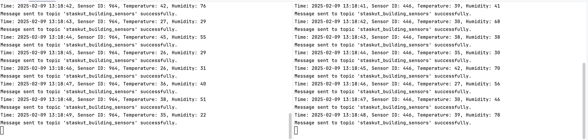
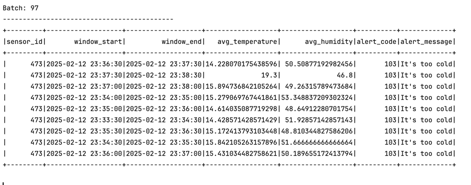
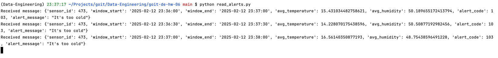

1. `create_topics.py` creates necessary Kafka topics.
2. `run_sensor.py` mocks sensor work and sends data to the Kafka topic.

3. `process_sensors_data.py` reads sensors data from the Kafka topic using Spark stream with a window, aggregates data and sends alerts to another Kafka topic if needed.

4. `read_alerts.py` reads alerts from the Kafka topic.
5. 